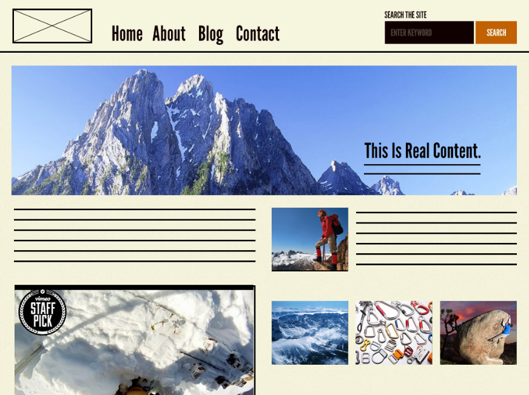

# Atomic Design

프론트엔드 개발자는 무엇보다 화면의 부분을 어떻게 컴포넌트로 나눠 가야 할지 고민하게 된다.
여기서 도입할 수 있는게 오늘 이야기 해 볼 Atomic Design이다.
아토믹 디자인은 화면을 구성하는 요소를 원자(Atom), 분자(Molecules), 유기체(Oranisms), 템플릿(Templates), 페이지(pages) 로 나눈 것으로
원자를 결합해 분자를, 분자를 결합해 유기체를, 유기체를 결합해 템플릿을, 템플릿을 결합해 페이지를 만들어 나가는 디자인 시스템이다.

 
원자 (Atom)

분자 (Molecules)

유기체 (Organisms)

템플릿 (Templates)

페이지 (Pages)

최종 

아토믹 디자인에 대한 상세는 이를 고안한 Brand Frost의 사이트에서 확인 할 수 있다. 
https://atomicdesign.bradfrost.com/

이 포스팅에서는 Vue, Vuex를 사용한 프로젝트에서 아토믹 디자인을 도입할 경우 Vuex와 아토믹 디자인의 컴포넌트를 어떻게 함께 사용할 수 있는지 한가지 예로 알아본다.

# Atomic Design과 Vuex 무엇이 고민인가

아토믹 디자인을 도입했을 때 만의 문제는 아니지만 '누가 Vuex를 의식해야 하는가?' 가 포인트다.

- 누가 Vuex Store의 State를 사용 가능한가?
- 누가 Vuex Store에 Action을 Dispatch 해도 되는가?

여기에 룰을 두지 않으면 상태를 어디에서 사용하는지, 어디에서 상태가 변경되는지 알기 어렵게 된다.
이미지화 해보면 아래의 그림과 같다.

